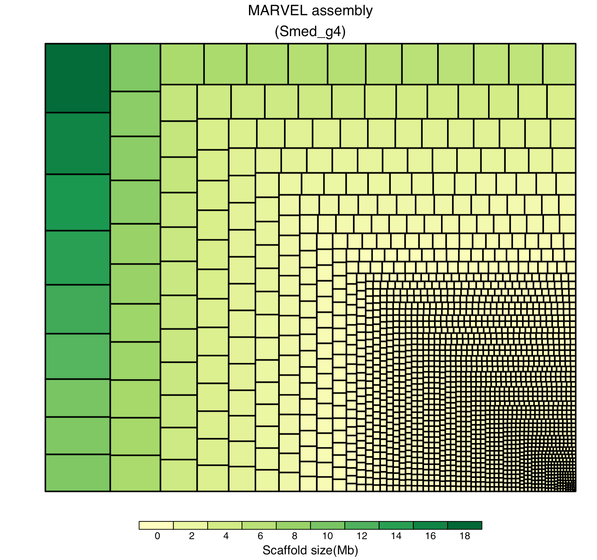

 <h1 align = "center">CNS经典图复刻01-涡虫基因组图片复刻</h1>

**我们不仅解读CNS文章，也帮您复刻CNS的图片。**


2018年1月24，*Nature*杂志背靠背发表两篇基因组文章，分别是美西螈和地中海圆头涡虫基因组。其中涡虫基因组的Figure1 令人印象深刻。研究者用树图方式，展示基因组组装的连续性，并且比较了新旧组装版本的连续性，体现了新版组装在完整性上的优越。

其中图片如下：


今天我们就来复刻Figure1中的图c，并且顺便也复刻一下图b。

Figure1c展示组装连续性非常直观，比N50,N90这些干巴巴的数据更有说服力。这幅图到底是用什么方法做的呢？好在作者直接在题注中直接说了是Treemap。


treemap是一个R包，用来可视化多维度层级数据。用来展示基因组长度完全是大材小用。

废话不多说，直接上treemap的示例图及代码：

```R
##绘制treemap图
library(treemap) 
data('GNI2014')
treemap( GNI2014,
        index=c('continent','iso3'),
        vSize='population',
        vColor='GNI',
        type='value'
)
```


> 这幅图展示了两个维度的两组数据。全球5大洲及主要国家的人口总数和国民总收入（GNI）。染色代表GNI，方块大小代表人口数量。粗线条方框和细线条方框分别代表洲和国家。这样的展示方式是不是很直观？

回到正题，我们先来下载文章涉及到的两个基因组（文章中有下载地址，另外数据已经上传到百度网盘），并且统计基因组大小。

**新旧基因组文件分别是** *GCA_002600895.1_ASM260089v1_genomic.fna*和*SmedSxl_genome_v4.0.nt*

- 首先统计基因组大小，为了方便展示，转成Mb。

  - perl版本

    ```perl
    #! /usr/bin/perl -w
    use strict;
    die "perl  $0 infa > outfile\n" unless @ARGV == 1;
    open IN,$ARGV[0] || die;
    $/=">";<IN>;$/="\n";
    while(<IN>){
            chomp;
            my $id = (split /\s+/,$_)[0];
    		$id =~ s/^>//;
            $/=">";chomp(my $fa=<IN>);$/="\n";
            $fa =~ s/\n+//g;
            my $len = length $fa;
    		my $len2 = sprintf "%.2f",$len/10**6;
    		print join ("\t",$id,$len,$len2),"\n";
    }
    close IN;
    ```

  - python版本

    ```python
    #! /usr/bin/env python
    import sys
    if len(sys.argv) < 2:
    	print (f"python {sys.argv[0]} infa > outfile")
    	sys.exit()
    seq={}
    with open(sys.argv[1],'r') as f:
    	for line in f.readlines():
    		if line.startswith('>'):
    			seqName = line.replace('\n', '')
    			seq[seqName]=[]
    		else:
    			seq[seqName].append(line.strip('\n'))
    
    for k, v in seq.items():
    	seq[k] = ''.join(v)
    	leng = len(seq[k])
    	k = k.replace('>','').split(' ')[0];
    	len2 = "{:.2f}".format(leng/10**6);
    	print (f"{k}\t{leng}\t{len2}")
    ```

    统计文件格式如下，三列分别是scaffoldID，序列长度 (bp)和序列长度（Mb）。

    

- 安装treemap包：`install.packages('treemap')`
- 直接贴1c左图的R代码

```R
##新版基因组长度分布，Figure 1c.left
library(treemap)
test <- read.table('new.fa.stat',header = F,sep = '\t')
pdf("Smed.treemap.left.pdf")
treemap(test,index=c('V1'),
     	vSize='V3',
     	vColor='V3',
     	type='value',
     	force.print.labels=F,
     	title="MARVEL assembly\n(Smed_g4)",
     	title.legend='Scaffold size(Mb)',
     	fontsize.labels=100,
     	lowerbound.cex.labels=1,
        range = c(0,18),
        mapping = c(-18,0,18),
)
dev.off()
```
- 1c右图的R代码

```R
##旧版基因组长度分布，Figure 1c.right
library(treemap)
test1 <- read.table('old.fa.stat',header = F,sep = '\t')
pdf("Smed.treemap.right.pdf")
treemap(test1,index=c('V1'),
     	vSize='V3',
     	vColor='V3',
     	type='value',
     	force.print.labels=F,
     	title="Sanger clone assembly\n(SmedSxl v4.0)",
     	title.legend='Scaffold size(Mb)',
     	fontsize.labels=100,
     	lowerbound.cex.labels=1,
        range = c(0,18),
        mapping = c(-18,0,18),
)
dev.off()
```
> 由于旧版基因组scaffold数目太多，导致作图比较慢，大概要20分钟左右。

这幅图要点如下：

1. treemap函数本身没有去掉标签的功能，不过可以通过两个标签设置参数来曲线实现。

   `fontsize.labels=100,lowerbound.cex.labels=1`

   fontsize.labels是设置标签大小，lowerbound.cex.labels=1表示只显示大小合适的标签，如果标签大小设置足够大，就不会显示标签了。

2. 颜色范围设置，通过`mapping`参数实现，最好设置成以0为界定正负对称的数字，这样展示值在0以上的颜色就不会出现两个色系，因为两个色系是以0为界的。

3. 通过`range`参数实现展示值范围，两幅图都设置成`c(0,18)`便于比较。`range = c(0,18)`和`mapping = c(-18,0,18)`必须一起设定。要不然两幅图的颜色展示就无法对比了。


<table>
 	<tr>
 		<td><center></center></td>
 		<td><center></center></td> 
 	</tr>
 </table>
- 顺便也展示一下人的染色体大小。


- 另外也顺手把Figure 1b的饼图也复刻一下。

```R
##Figure 1b
par(pin=c(4,3),mai=c(1,2.5,1,0.1))
qc <- c ('MARVEL false joins','Not resolvable','HiRise false break',
         'HiRise false joins','Alternative haplotig choice')
num <- c(2,4,2,11,32)
percent <- round(num/sum(num)*100, 0)
label <- paste0(percent, "%")
col <- c('red','orange','yellow','green3','green4')
pie(num, border="black", col=col,label=label,
    edges = 200, radius = 0.8,init.angle=90,lty=1)
legend("left", paste0(qc,'(',num,')'), cex=0.8,fill=col,bty='n',xpd=TRUE,inset=-.5)
```


本文涉及到的数据，文章，脚本及图片均已上传到百度网盘，欢迎下载交流。

链接: https://pan.baidu.com/s/196XQccSJj2_xaTfbiwlHdg  密码: 1hcn


